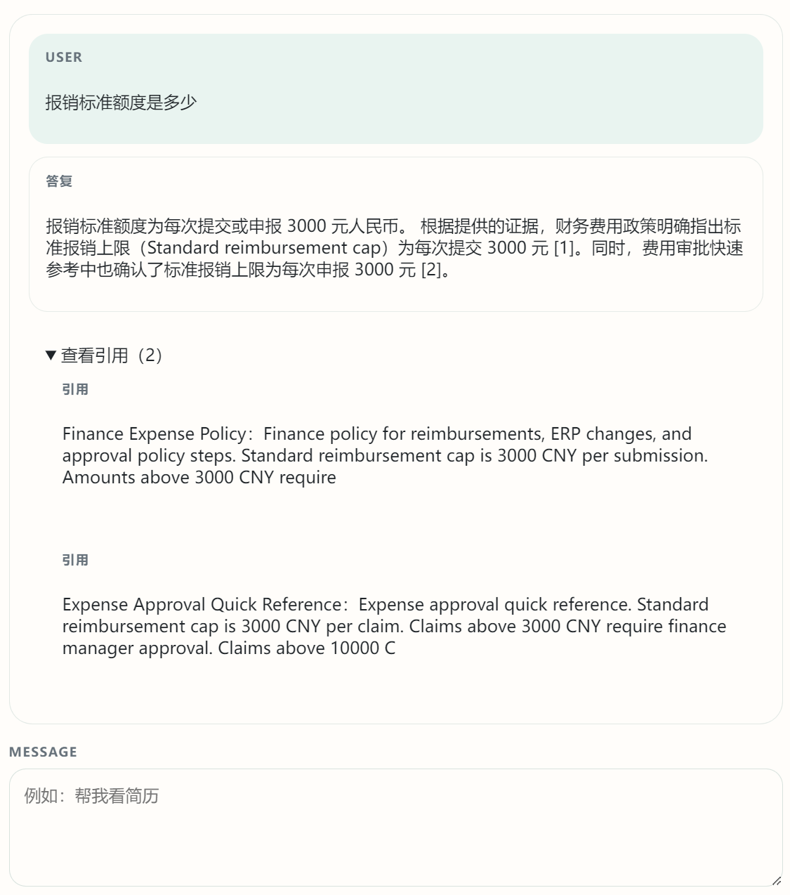
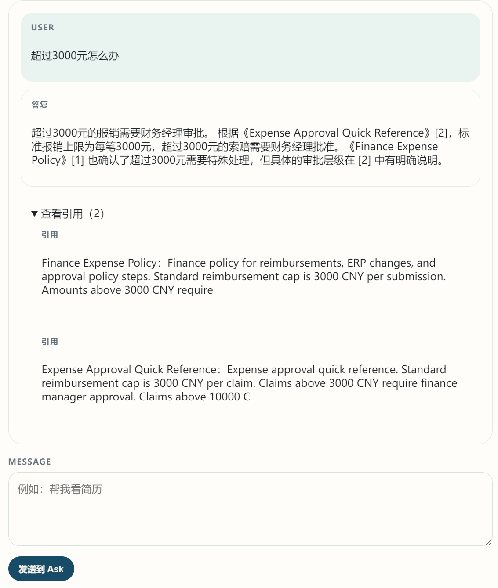
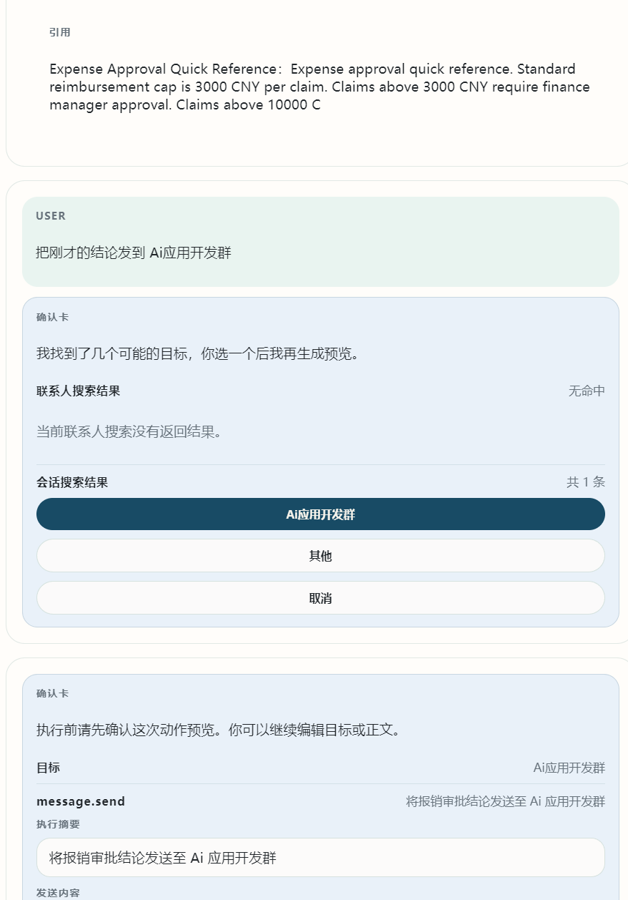
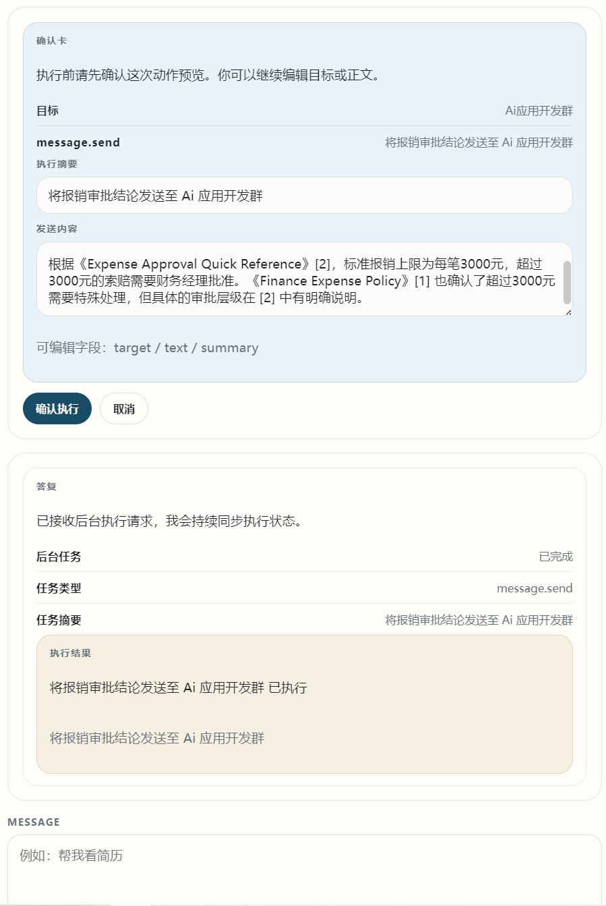

# EMATA Runtime - Ask Runtime

**Enterprise Memory-Augmented Task Agent**


`EMATA Runtime` 是一个面向企业内部知识问答与任务协同的 Ask Runtime 原型。它基于 **FastAPI + Next.js** 构建，把企业级 RAG、结构化上下文、可控工具执行和协同动作预览统一到一套可扩展运行时中。

它不是单纯的聊天页面，而是一个围绕企业内工作流设计的运行时系统：

- `/knowledge`：知识运营台，用于文档入库、索引状态查看和知识检索链路运营。
- `/ask`：统一对话入口，用于问答、上下文复用、动作预览和确认执行。

> Public repo note: this repository intentionally excludes local runtime files, `.env`, virtual environments, generated caches, private docs, and temporary data.

## Contents

- [Features](#features)
- [Architecture](#architecture)
- [Demo Scenarios](#demo-scenarios)
- [Tech Stack](#tech-stack)
- [Repository Layout](#repository-layout)
- [Quick Start](#quick-start)
- [Environment Variables](#environment-variables)
- [Testing](#testing)
- [Security Notes](#security-notes)
- [Current Limits](#current-limits)
- [Roadmap](#roadmap)

<a id="features"></a>

## Features

- **Grounded enterprise RAG**: search, rerank, answer generation, and citations are separated so answers can be traced back to evidence.
- **Structured context runtime**: conversation memory, working context, and pending action drafts are managed as runtime state instead of being mixed into one long prompt.
- **Controlled agent execution**: risky enterprise actions follow a `preview -> confirm -> execute` flow.
- **Knowledge and action surfaces**: `/knowledge` manages knowledge ingestion, while `/ask` coordinates user-facing Q&A and actions.
- **Provider adapters**: Milvus, MinerU, lark-cli, and DashScope-compatible model APIs are behind integration boundaries.
- **Modular layering**: runtime, skill, tool, knowledge, and policy concerns are kept separate to make future skills and providers replaceable.

<a id="architecture"></a>

## Architecture

EMATA Runtime is organized around five layers.

### Runtime

The runtime coordinates each Ask turn:

- intent routing
- command and turn orchestration
- context reads and writes
- knowledge Q&A versus action planning
- async job state and SSE-style progress updates

The goal is to keep the conversation entrypoint independent from any single business domain.

### Skill

Skills represent domain-specific capabilities. The current prototype includes an HR recruiting skill, while the boundaries are designed to support additional domains such as finance, sales, operations, or internal support.

### Tool

Tools adapt external capabilities into controlled interfaces. Skills do not call provider commands directly; they use tool adapters for services such as Milvus, MinerU, lark-cli, and model APIs.

### Knowledge

The knowledge layer handles document upload, parsing, chunking, vector indexing, retrieval traces, and RAG input preparation. It serves both `/knowledge` and `/ask`.

### Policy

The policy layer defines execution boundaries. Medium-risk and high-risk actions are previewed first and executed only after confirmation.

## RAG Flow

```text
User question
-> Intent router
-> Knowledge search
-> Rerank
-> Context packing
-> Answer generation
-> Answer with citations
```

The default model setup is DashScope-compatible:

- embedding: `text-embedding-async-v1`
- vector store: `Milvus`
- rerank: `qwen3-rerank`
- generation: `qwen3.5-flash`

The Ask runtime supports both grounded enterprise answers and general LLM answers. Enterprise knowledge questions are answered from retrieved evidence with citations. General questions can fall back to the model without pretending to be based on internal documents.

## Context Model

Context is split into three parts:

- **Conversation memory**: recent natural language turns for short-term continuity.
- **Working context**: current task state, such as candidate, job description, target group, previous conclusion, and retrieval mode.
- **Pending action draft**: structured action preview data, including target, content, risk level, and execution parameters.

This keeps tool execution state separate from natural language history and makes interrupted workflows easier to resume.

## Agent Execution Model

```text
Intent router
-> Action planner
-> Target resolver
-> Preview card
-> Confirm or cancel
-> Tool execute
-> Result and trace
```

The prototype deliberately favors controlled execution over full automation. Enterprise actions such as sending group messages, creating meetings, or sharing content should be reviewed before they are executed.

<a id="demo-scenarios"></a>

## Demo Scenarios

### 1. Grounded RAG

Ask:

```text
报销标准额度是多少
```

Then ask:

```text
超过3000元怎么办
```

This demonstrates retrieval, reranking, grounded answer generation, citations, and follow-up context.





### 2. Context Reuse and Group Messaging

Ask:

```text
报销标准额度是多少
```

Then ask:

```text
把刚才的结论发到 Ai应用开发群
```

This demonstrates working-context reuse and the `preview -> confirm -> execute` action flow.





### 3. Dialog-driven Coordination

Ask:

```text
下午五点在 Ai应用开发群开会！
```

This demonstrates action parsing, target resolution, preview confirmation, and calendar-style coordination.

<a id="tech-stack"></a>

## Tech Stack

### Backend

- FastAPI
- SQLAlchemy
- SQLite / PostgreSQL snapshot persistence
- Milvus
- MinerU
- lark-cli
- Temporal workflow components

### Frontend

- Next.js 15
- React 19
- API adapter and view-model style frontend modules

### Models

- DashScope-compatible API
- `text-embedding-async-v1`
- `qwen3-rerank`
- `qwen3.5-flash`

<a id="repository-layout"></a>

## Repository Layout

```text
.
├─ backend/
│  ├─ app/
│  │  ├─ ask/
│  │  ├─ integrations/
│  │  └─ knowledge/
│  ├─ scripts/
│  └─ tests/
├─ frontend/
│  ├─ app/
│  ├─ components/
│  ├─ lib/
│  └─ tests/
├─ images/demo/
├─ infra/
├─ scripts/
├─ docker-compose.yml
├─ docker-compose.demo.yml
├─ docker-compose.prod.yml
├─ .env.example
└─ README.md
```

<a id="quick-start"></a>

## Quick Start

### Prerequisites

- Python 3.10+
- Node.js 20+
- Docker Desktop
- Git

### 1. Configure environment

```powershell
Copy-Item .env.example .env
```

Edit `.env` and provide the model, embedding, rerank, Milvus, and Feishu values you actually use. Do not commit `.env`.

### 2. Start middleware with Docker

```powershell
docker compose up -d postgres redis temporal temporal-ui etcd minio milvus
```

### 3. Start backend locally

```powershell
cd backend
python -m venv .venv
.\.venv\Scripts\Activate.ps1
pip install -r requirements.txt -r requirements-dev.txt
python -m uvicorn app.main:app --host 127.0.0.1 --port 8000
```

### 4. Start frontend locally

```powershell
cd frontend
npm install
npm run dev
```

Default local entrypoints:

- API: [http://127.0.0.1:8000](http://127.0.0.1:8000)
- Ask: [http://127.0.0.1:3000/ask](http://127.0.0.1:3000/ask)
- Knowledge: [http://127.0.0.1:3000/knowledge](http://127.0.0.1:3000/knowledge)
- Temporal UI: [http://127.0.0.1:8088](http://127.0.0.1:8088)

### Full Docker

```powershell
docker compose up --build
```

Full Docker mode does not install the MinerU runtime by default because the PDF parsing runtime can be large. To enable it in container startup, set this in `.env`:

```powershell
EMATA_INSTALL_MINERU_RUNTIME=true
```

<a id="environment-variables"></a>

## Environment Variables

Use `.env.example` as the template.

### Model and RAG

- `EMATA_MODEL_BASE_URL`
- `EMATA_MODEL_API_KEY`
- `EMATA_MODEL_NAME`
- `EMATA_RERANK_BASE_URL`
- `EMATA_RERANK_API_KEY`
- `EMATA_RERANK_MODEL`
- `EMATA_EMBEDDING_BASE_URL`
- `EMATA_EMBEDDING_API_KEY`
- `EMATA_EMBEDDING_MODEL`

### Knowledge

- `EMATA_MILVUS_URI`
- `EMATA_MILVUS_COLLECTION`
- `EMATA_UPLOAD_BASE_DIR`
- `EMATA_STORAGE_BACKEND`
- `EMATA_MINERU_EXECUTABLE`
- `EMATA_INSTALL_MINERU_RUNTIME`

### Feishu

- `EMATA_FEISHU_APP_ID`
- `EMATA_FEISHU_APP_SECRET`
- `EMATA_DEFAULT_INTERNAL_CHAT_QUERY`

### Frontend

- `NEXT_PUBLIC_API_BASE_URL`

<a id="testing"></a>

## Testing

Backend:

```powershell
cd backend
python -m pytest
```

Frontend:

```powershell
cd frontend
npm test
```

Build check:

```powershell
cd frontend
npm run build
```

<a id="security-notes"></a>

## Security Notes

This project is public, so keep secrets out of Git:

- never commit `.env`
- never commit API keys, Feishu secrets, database passwords, or provider tokens
- use `.env.example`, `.env.demo.example`, and `.env.production.example` for placeholders only
- rotate any credential that was ever committed or pasted into a public place
- keep runtime files, uploads, caches, and generated databases outside tracked files

The repository already ignores local runtime directories such as `.venv/`, `.runtime/`, `.pytest_cache/`, `.next/`, `node_modules/`, `tmp/`, and `.env`.

<a id="current-limits"></a>

## Current Limits

The prototype is best suited for showing:

- enterprise knowledge Q&A
- Milvus retrieval with rerank and answer generation
- multi-turn working context
- controlled agent execution
- internal group messaging and scheduling-style coordination

Known boundaries:

- external contacts and external group workflows are not the focus yet
- high-risk actions are not executed automatically
- production-grade authorization and audit governance are still incomplete
- provider credentials and enterprise tenant setup are environment-specific

## Why This Project Matters

The project demonstrates how RAG, context management, agent planning, and tool use can be combined into one runtime instead of being scattered across prompts and page-level code. The engineering value is in the runtime boundaries, retrieval traceability, state model, and controlled execution policy.

In one sentence:

> EMATA Runtime is an enterprise Ask Runtime that unifies grounded knowledge Q&A, structured context, and controlled tool execution in a modular system.

<a id="roadmap"></a>

## Roadmap

- stronger intent routing
- more general action planning
- more robust target resolution
- richer async execution and progress traces
- better observability for retrieval and tool calls
- more enterprise skill modules
- fuller authorization, audit, and policy controls

## License

No open-source license has been added yet. If this repository is intended for long-term public use, add an explicit license and re-check the repository for sensitive data before publishing new releases.
